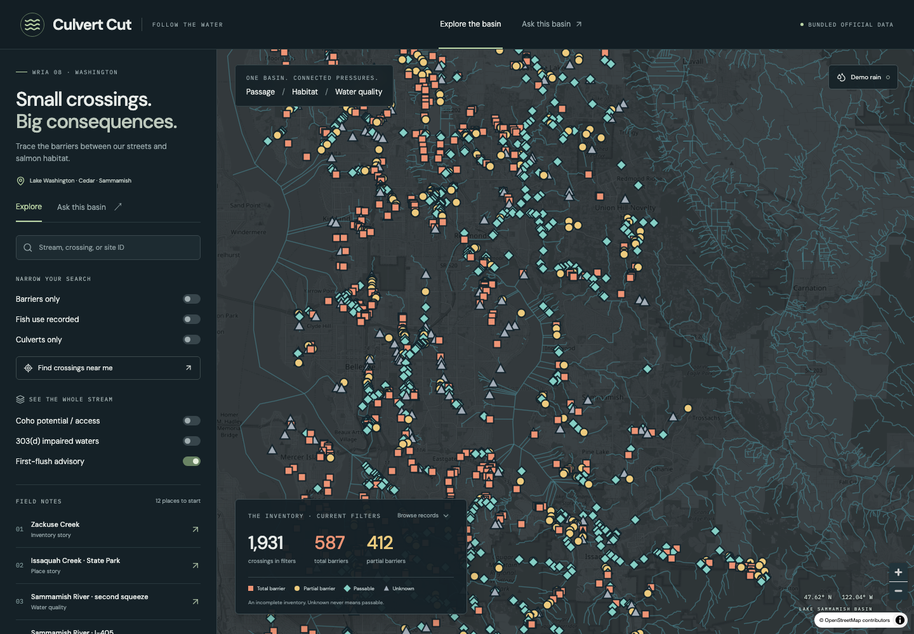

# Culvert Cut

**Follow the water.** A WRIA 8 map of real fish-passage barriers, habitat-access context, and water-quality assessments, with a tiny local specialist training pipeline and citation-backed explanations.

Built for NextStep Hacks 2026 — Earth Forward. A new project scoped as a 20-hour student build. No prize, eligibility, or measured restoration outcome is claimed.

## Run the working demo

Requires Node 22.18+ (or Node 24) and npm.

```sh
npm install
npm run dev
```

Open the localhost URL printed by Vite. `npm run build` creates a static `dist/` directory; `npm run preview` serves the build. No API key, account, Python, model download, or GPU is needed for the app. The included Pages workflow builds and publishes the static demo. Map tiles and optional fonts require internet; the bundled records, filters, drawer, and Ask work without external data APIs. Use “Browse records” if WebGL or tiles are unavailable. This is not a service-worker offline app.



## What it does

- MapLibre map centered on Sammamish, Issaquah, and Redmond, with official streams and 1,931 real WDFW WRIA 8 site records.
- Total / partial / passable / unknown symbols with both color and shape. Filters intersect; near-me searches within 5 km, falling back to Sammamish City Hall (47.6163, -122.0356).
- King County coho intrinsic potential and current anadromous access overlay, plus Ecology 303(d) assessment geometry. Potential habitat is distinct from species observations.
- Site drawer with recorded stream, feature, fish use, owner type, survey date, and explicit unknowns; official report link; three-sentence briefing copy.
- Twelve field-note stories, including Zackuse, Issaquah Creek, Juanita, Sammamish River heat, driveway culverts, highway / city contrast, and spawn-watch context.
- Local-only photo queue using browser localStorage. Images must be under 1.5 MB; clear the queue from the drawer. No submission endpoint exists.
- Ask retrieves up to three site records and two source snippets, then renders grounded statements with source chips. Empty retrieval refuses. Optional local model output passes an extractive allowlist gate before display.
- Demo first-flush advisory: `rain in next 24h AND dry days >= 5`. Demo rain toggles the first input; the canned climate state has six dry days. No live forecast or chemistry is fetched.

## Earth Forward

Pipes, hot water, and first-flush runoff are connected pressures in one basin. A restored crossing can improve passage while heat or downstream barriers still limit habitat access. Culvert Cut makes those distinctions visible and helps residents prepare a specific question for public works. It does not prioritize engineering projects, detect new barriers, promise habitat gains, or measure 6PPD-quinone.

## Official data and refresh

Run `python3.11 scripts/fetch_layers.py`, then `python3.11 scripts/build_stories.py` and `python3.11 scripts/build_jsonl.py`. Fetching uses the standard library, queries IDs first, downloads chunks, checks truncation, and replaces each successful snapshot atomically. Failures preserve that layer's prior file and are recorded in `public/data/manifest.json`; a refresh with any failure exits nonzero. The manifest timestamp records the refresh attempt, so inspect its errors before treating all layers as newly refreshed.

Bounding box: longitude -122.25 to -121.85; latitude 47.45 to 47.78. WDFW points also require `WRIANumber=8`. Other overlays are bbox extracts, not a WRIA polygon clip. All bundled inventory points were fetched from official services; no synthetic crossings were needed.

| Layer | Bundled features | Source |
|---|---:|---|
| WDFW passage sites | 1,931 | [FP_Sites MapServer](https://geodataservices.wdfw.wa.gov/arcgis/rest/services/ApplicationServices/FP_Sites/MapServer) |
| King County streams `wtrcrs_line` | 1,989 | [Service](https://services.arcgis.com/Ej0PsM5Aw677QF1W/arcgis/rest/services/WTRCRS_LINE_176/FeatureServer/0) |
| King County `fp_cohointrinsicpotential_line` | 12,194 | [Service](https://services.arcgis.com/Ej0PsM5Aw677QF1W/arcgis/rest/services/FP_COHOINTRINSICPOTENTIAL_LINE_2880/FeatureServer/0) |
| King County `fp_fishpassagesites_point` | 5,338 | [Service](https://services.arcgis.com/Ej0PsM5Aw677QF1W/arcgis/rest/services/FP_FISHPASSAGESITES_POINT_2879/FeatureServer/0) |
| Ecology 303(d) | 340 | [Current assessment service](https://services.arcgis.com/6lCKYNJLvwTXqrmp/arcgis/rest/services/WQ/FeatureServer/4) |

King County points are retained for pipeline inspection, not merged into the WDFW display: cross-inventory deduplication has not been verified. WDFW layer classifications and coded-value domains drive normalization. Original properties remain in the GeoJSON; `source`, `status`, and display fields are added. Unknown includes unknown passability at a known barrier; “barriers only” includes those when the raw barrier code is yes. Non-fish-bearing, diversion, and natural-barrier layers are outside this crossing-focused snapshot. WSDOT context comes from actual WDFW records with `ProjectName=WSDOT`, not a separately fetched injunction inventory.

Sources for explanations:

- [WDFW Fish Passage Inventory, Assessment, and Prioritization Manual (2019, 284 pages)](https://wdfw.wa.gov/publications/02061): assessment guidance and habitat-survey context; snippets are concise paraphrases, not invented page quotations.
- [WRIA 8 2025 progress report](https://govlink.org/watersheds/8/reports/WRIA82025ProgressReport.pdf): 28.6 riparian acres planted against a 69-acre Sammamish River goal, approximately 41%.
- [City of Sammamish Zackuse project](https://www.sammamish.us/projects/zacuse-creek-fish-passage-restoration/) and [historical King County kokanee emergency](https://kcemployees.com/2018/05/11/taking-emergency-action-to-prevent-the-possible-extinction-of-native-kokanee-salmon/): historical context, not current run counts. The supplied brief's citywide Wild Fish Conservancy assessment attribution was not independently verified and is not asserted as a completed data join.
- [Ecology 6PPD background](https://ecology.wa.gov/waste-toxics/reducing-toxic-chemicals/reducing-toxic-chemicals-washington/6ppd) and [King County sampling report](https://your.kingcounty.gov/dnrp/library/2024/kcr3832/kcr3832.pdf): toxicity and sampling context; no concentration measurement is generated.
- [Ecology assessment explanation](https://ecology.wa.gov/water-shorelines/water-quality/water-improvement/assessment-303d-list): listings are assessments, not live readings.

## Specialist model: reproducible training, honest status

**No adapter weights are bundled or claimed to be trained.** This machine's delivery uses the expressly supported CPU/RAG-only path. `adapter/.gitkeep` is not a trained model. The model work delivered is a domain dataset, executable LoRA training and inference code, held-out evaluator, and optional guarded API.

The committed dataset has 3,024 train pairs and 40 validation pairs. Examples use a compact projection of actual official fields (not every raw property), source snippets, briefings, unknown/refusal cases, and same-stream contrasts. The system instruction matches the objective. Supervision is deterministic and templated, not expert annotation. The 40 held-out site IDs are excluded from every training context, including contrasts. Snapshot-derived facts should not be memorized as current conditions.

```sh
python3.11 -m venv .venv
source .venv/bin/activate
pip install -r requirements.txt
python scripts/build_jsonl.py
python train.py                       # 2 epochs on CUDA; explicit skip without CUDA
python train.py --cpu                 # optional 200-step CPU LoRA run, potentially slow
# MODEL_NAME=Qwen/Qwen2.5-1.5B-Instruct python train.py --epochs 1
python eval_hallucination.py           # actual adapter if present, otherwise base
python eval_hallucination.py --base-only
python eval_hallucination.py --template # fast reference check; NOT an LLM evaluation
```

Default base: `Qwen/Qwen2.5-0.5B-Instruct`. PEFT LoRA rank 16, alpha 32, q/k/v/o projections; TRL SFTTrainer; maximum sequence length 768; completion-only loss; 1–3 epochs. CPU uses float32. Training saves to `adapter/`, with run metadata. Qwen weights are downloaded from Hugging Face only when running the Python model path; no hosted LLM inference is called. Verify model licensing before redistribution. Requirements constrain compatible API families; the heavy ML environment and actual training were not executed during delivery.

The identifier evaluator retains raw outputs for 40 held-out sites and fails on unknown emitted IDs or missing expected citations. It handles exact official IDs containing spaces, prefixed IDs, bracket IDs, and suspicious bare six-digit IDs. Regex coverage is not a formal guarantee: arbitrary identifier formats, owner hallucinations, incorrect coordinates, and biological reasoning need additional factual evaluation. The template reference passed 40/40 with zero unknown IDs and zero missing citations; this is not a base/adapter score.

```sh
python infer.py --context data/zackuse_fixture.json --question 'Explain this crossing.'
uvicorn server:app --host 127.0.0.1 --port 8000
```

In Vite, enable “Use optional local model.” Vite proxies `/api` to loopback. Static deployments remain templates unless separately configured with a trusted API. The server re-retrieves canonical local records, never trusts client-supplied factual fields, refuses empty context, and displays only exact supported sentences with matching citations. All other model wording falls back to templates. Greedy inference has no stochastic sampling (effectively temperature zero). Run one local worker because model access is serialized.

### Video comparison fixture: Zackuse Site 920121

Same input: “Explain this site and whether kokanee can reach habitat above it.”

| Base model | Adapter / grounded target |
|---|---|
| **Not measured.** Do not narrate an invented rambling answer as a model result. | **Adapter not trained.** The running template says Site 920121 is total on Zackuse Cr and upstream species access is not verified. |
| Illustrative failure mode: unsupported claims that every kokanee can reach habitat after fixing one crossing. This is an authored anti-example, not generated output. | Expected behavior: cite 920121, explain the recorded status, and refuse the unsupported connectivity inference. This is a target, not a measured adapter output. |

After training, run `python scripts/compare_models.py`. It records actual base and adapter responses on the identical Zackuse context in `data/comparison_actual.json` and refuses to run without an adapter. Show the real outputs only after reviewing them. No performance improvement is claimed in the supplied video script.

## What is mocked or incomplete

Weather is a labeled canned demonstration; photos are local mock reports. Story-only place coordinates are approximate and labeled “illustrative pin pending live join.” They do not create inventory sites or assign barrier status. A driveway is classified as a culvert; “driveway” comes from its recorded road name. Passable is not automatically corrected. The WDFW record's correction-years field is displayed when present.

Site-level 303(d) intersection, stream-network routing, piped length, named owners, fish observations, and species-specific access above are not established by the provided site schema. These remain unknown/not supplied. The impairment overlay renders official assessment polygons, including all parameters, rather than pretending polygon boundaries are exact stream centerlines. It is not a water-safety tool or engineering assessment. First-flush advice is a general runoff-reduction reminder, not a validated local risk forecast.

MapLibre makes the JS bundle relatively large; OpenStreetMap public raster tiles carry attribution. The Google font has system-font fallbacks. No external imagery, proprietary GIS, private records, or secrets are included.

## Before vs During

**Before:** no project source, dataset, app, or model work existed in this repository.

**During:** app implementation, official snapshots, normalization, story/source curation, 3,024-pair dataset, training/inference/evaluation scripts, checks, and submission drafts were created for this build. AI-assisted implementation must be disclosed according to the event's rules. The repository does not assert that any particular student personally completed every step.

## Validation

```sh
npm test
npm run build
python3.11 -m unittest discover -s tests
python3.11 eval_hallucination.py --template
# Browser regression checks (one-time browser install):
npx playwright install chromium
npm run dev
npx playwright test
```

Checks cover filter intersections, near-me distances, empty retrieval, citations, first-flush boundary conditions, three-sentence briefings, disjoint train/validation contexts, model-ID guard behavior, and desktop/mobile browser interactions. No LLM-training result is substituted for an unrun evaluation.

Submission materials: `DEVPOST.md` and `VIDEO_SCRIPT.md`. The video script is about three minutes; an actual recording is still a submission step. The deadline from the brief is September 20, 2026, 2:00 pm PDT.
